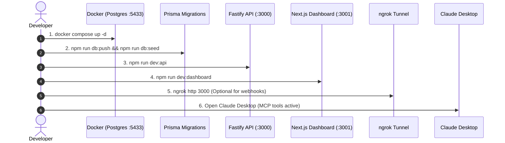

# Agent Commerce Middleman (ACM) — Complete Operating & Demo Guide

> **A Comprehensive Guide to Architecture, Startup Runbooks, and Full End-to-End Demonstration Flows.**

---

## Table of Contents

1. [How the App Works (System Architecture)](#1-how-the-app-works-system-architecture)
2. [Sequential Startup Runbook (Every Restart)](#2-sequential-startup-runbook-every-restart)
3. [All App Capabilities & Functions](#3-all-app-capabilities--functions)
4. [Step-by-Step Complete Demo Walkthrough](#4-step-by-step-complete-demo-walkthrough)
   - [Demo 1: Browsing Catalog & Smart Add-On Recommendations](#demo-1-browsing-catalog--smart-add-on-recommendations)
   - [Demo 2: Auto-Approved Autonomous Transaction (< ₹500 Threshold)](#demo-2-auto-approved-autonomous-transaction--500-threshold)
   - [Demo 3: Gated Transaction & Dashboard Human Approval (> ₹500 Threshold)](#demo-3-gated-transaction--dashboard-human-approval--500-threshold)
   - [Demo 4: Policy Rejection (Exceeding Mandate Limits)](#demo-4-policy-rejection-exceeding-mandate-limits)
   - [Demo 5: Simulating Payment Settlement via Razorpay Webhooks](#demo-5-simulating-payment-settlement-via-razorpay-webhooks)
   - [Demo 6: Visual Audit Timeline Exploration](#demo-6-visual-audit-timeline-exploration)
   - [Demo 7: Refund Processing](#demo-7-refund-processing)
5. [Connecting Claude Desktop via MCP](#5-connecting-claude-desktop-via-mcp)
6. [Troubleshooting & Handy Commands](#6-troubleshooting--handy-commands)

---

## 1. How the App Works (System Architecture)

**Agent Commerce Middleman (ACM)** is a zero-trust financial guardrail layer for autonomous AI agents. Rather than giving LLMs direct access to credit cards or unrestricted payment APIs, ACM enforces strict, deterministic policy checks and human-in-the-loop workflows.

```mermaid
flowchart TD
    subgraph AgentClient ["Agent Layer"]
        Claude["Claude Desktop / AI Agent"]
        MCP["ACM MCP Server<br>(apps/mcp-server)"]
    end

    subgraph CoreBackend ["Gateway Backend (:3000)"]
        API["Fastify API Layer"]
        PolicyEngine["Deterministic Policy Engine<br>(packages/policy-engine)"]
        DB[("PostgreSQL DB (:5433)<br>(packages/db)")]
    end

    subgraph PaymentsLayer ["Payments & Webhooks"]
        RazorpayAPI["Razorpay API<br>(Orders & Payment Links)"]
        Webhook["Webhook Listener<br>(/webhooks/razorpay)"]
        Ngrok["ngrok Public Tunnel"]
    end

    subgraph OperatorUI ["Human-in-the-Loop (:3001)"]
        Dashboard["Next.js Operator Dashboard<br>(apps/dashboard)"]
    end

    Claude -->|MCP Tools (stdio)| MCP
    MCP -->|HTTP REST| API
    API -->|Evaluate Mandate| PolicyEngine
    PolicyEngine -->|Write Decisions & Logs| DB
    PolicyEngine -->|Auto-Approved| RazorpayAPI
    PolicyEngine -->|Gated / High Value| DB
    DB -.->|Poll Pending Orders| Dashboard
    Dashboard -->|Manual Human Approval| API
    API -->|Create Order & Link| RazorpayAPI
    RazorpayAPI -->|Signed Webhook| Ngrok --> Webhook --> DB
```

### Core Components & Roles

1. **Deterministic Policy Engine (`packages/policy-engine`)**:
   - Evaluates pure JavaScript rules against every quote.
   - **`agent_valid`**: Ensures the agent is active and not revoked.
   - **`mandate_coverage`**: Verifies merchant and product category whitelist.
   - **`per_txn_cap`**: Ensures transaction doesn't exceed per-order maximum.
   - **`daily_cap`**: Calculates 24h cumulative spend and denies transactions exceeding the limit.
   - **`gate_threshold`**: Routes orders above a threshold (e.g., ₹500) to human review.
   - **`gate_first_time`**: Routes orders to human review if it's the agent's first transaction with the merchant.

2. **Backend API (`apps/api`)**:
   - Manages catalog, quotes, payment orders, audit logs, and webhooks.
   - Listens on `http://localhost:3000`.

3. **Human-in-the-Loop Dashboard (`apps/dashboard`)**:
   - Next.js web application on `http://localhost:3001`.
   - `/approvals`: Live queue to inspect, approve (generate payment link), or decline gated orders.
   - `/audit/[correlationId]`: Visual, immutable audit graph tracking every decision and state transition.

4. **MCP Server (`apps/mcp-server`)**:
   - Native Model Context Protocol interface exposing stdio tools directly to Claude Desktop.

---

## 2. Sequential Startup Runbook (Every Restart)

Whenever you start or restart your machine or work session, follow these steps in order:



### Step 1: Start PostgreSQL Container
In the `acm/` directory:
```bash
docker compose up -d
```
*Verify it is running on port 5433:* `docker ps`

---

### Step 2: Push Database Schema & Seed Demo Data
```bash
npm run db:push
npm run db:seed
```
*This populates test merchants, grocery catalog items, and active agent spending mandates.*

---

### Step 3: Start the Backend API (Terminal 1)
```bash
npm run dev:api
```
*Runs on `http://localhost:3000`. Verify with:*
```bash
curl http://localhost:3000/health
# Output: {"status":"ok"}
```

---

### Step 4: Start the Next.js Dashboard (Terminal 2)
```bash
npm run dev:dashboard
```
*Runs on `http://localhost:3001`.*
- Open in browser: **[http://localhost:3001/approvals](http://localhost:3001/approvals)**

---

### Step 5: (Optional) Start ngrok Webhook Tunnel (Terminal 3)
If you are testing live Razorpay webhook delivery:
```bash
ngrok http 3000
```
*Add the generated URL `https://<subdomain>.ngrok-free.dev/webhooks/razorpay` to your Razorpay Dashboard webhooks.*

---

## 3. All App Capabilities & Functions

| Function / Tool | Description | Access Point |
|---|---|---|
| `browse_catalog` | Fetches available products with SKUs, prices, categories, and inventory. | API: `GET /v1/catalog`<br>MCP: `browse_catalog` |
| `suggest_addons` | Intelligent recommendation of complementary items based on current cart. | API: `POST /v1/suggest-addons`<br>MCP: `suggest_addons` |
| `get_quote` | Computes item totals, tax, and generates an expiring quote ID. | API: `POST /v1/quotes`<br>MCP: `get_quote` |
| `initiate_payment` | Validates deterministic mandate rules and executes or gates payment. | API: `POST /v1/payments`<br>MCP: `initiate_payment` |
| `decide_approval` | Operator approves or declines a gated order, instantly generating Razorpay order + payment link. | Dashboard: `/approvals`<br>API: `POST /v1/pending-approvals/:id/decide` |
| `check_status` | Returns transaction lifecycle state (`gated`, `order_created`, `paid`, `failed`, `refunded`). | API: `GET /v1/transactions/:id`<br>MCP: `check_status` |
| `webhook_verification` | Constant-time HMAC-SHA256 signature verification of incoming Razorpay events. | API: `POST /webhooks/razorpay` |
| `audit_explorer` | End-to-end timeline tracing all decisions with correlation IDs. | Dashboard: `/audit/[correlationId]`<br>API: `GET /v1/audit/:correlationId` |
| `request_refund` | Triggers a Razorpay refund for completed transactions and records audit trail. | API: `POST /v1/transactions/:id/refund`<br>MCP: `request_refund` |

---

## 4. Step-by-Step Complete Demo Walkthrough

Use these commands/steps to demonstrate every feature of the app to users or stakeholders.

---

### Demo 1: Browsing Catalog & Smart Add-On Recommendations

#### 1. Fetch Catalog:
```bash
curl -s http://localhost:3000/v1/catalog | jq .
```
*Shows items like Basmati Rice, Milk, Bread, Ghee, Butter.*

#### 2. Get Smart Add-On Recommendations:
Simulate an agent having Bread (`bread-whole-wheat`) in the cart:
```bash
curl -s -X POST http://localhost:3000/v1/suggest-addons \
  -H "Content-Type: application/json" \
  -d '{"skus": ["bread-whole-wheat"]}' | jq .
```
*Returns Butter (`butter-salted-500g`) automatically based on pairing relations.*

---

### Demo 2: Auto-Approved Autonomous Transaction (< ₹500 Threshold)

Simulates an agent ordering small essentials that satisfy all limits and require zero human intervention.

```bash
node -e "
import { PrismaClient } from '@prisma/client';
const prisma = new PrismaClient();
async function demoAutoApprove() {
  const mandate = await prisma.mandate.findFirst();
  // Create quote for ₹360 (2x Milk @ ₹180) -> under ₹500 auto-approve threshold
  const quote = await prisma.quote.create({
    data: {
      items: [{ sku: 'milk-tetra-1l', qty: 2 }],
      total: 36000,
      expiresAt: new Date(Date.now() + 15 * 60 * 1000)
    }
  });
  console.log('1. Generated Quote ID:', quote.id, 'Total: ₹360.00');

  const res = await fetch('http://localhost:3000/v1/payments', {
    method: 'POST',
    headers: { 'Content-Type': 'application/json' },
    body: JSON.stringify({ quoteId: quote.id, mandateId: mandate.id })
  });
  const data = await res.json();
  console.log('2. Policy Engine Response:');
  console.log(data);
}
demoAutoApprove();
"
```
**Outcome**:
- Result: `status: "payment_link_created"`
- Razorpay Order & Payment Link created automatically.
- No human intervention required.

---

### Demo 3: Gated Transaction & Dashboard Human Approval (> ₹500 Threshold)

Simulates a high-value order that is held for human review.

#### Step A: Agent attempts high-value purchase (₹1,300):
```bash
node -e "
import { PrismaClient } from '@prisma/client';
const prisma = new PrismaClient();
async function demoGated() {
  const mandate = await prisma.mandate.findFirst();
  const quote = await prisma.quote.create({
    data: {
      items: [{ sku: 'rice-basmati-5kg', qty: 2 }],
      total: 130000, // ₹1,300
      expiresAt: new Date(Date.now() + 15 * 60 * 1000)
    }
  });
  console.log('Quote generated:', quote.id, '(₹1,300)');
  const res = await fetch('http://localhost:3000/v1/payments', {
    method: 'POST',
    headers: { 'Content-Type': 'application/json' },
    body: JSON.stringify({ quoteId: quote.id, mandateId: mandate.id })
  });
  const data = await res.json();
  console.log('Response:', data);
}
demoGated();
"
```
**Outcome**:
```json
{
  "status": "awaiting_human_approval",
  "reason": "quote exceeds auto-approve threshold",
  "transactionId": "cmtit..."
}
```

#### Step B: Operator Reviews in Dashboard
1. Open **[http://localhost:3001/approvals](http://localhost:3001/approvals)**.
2. The transaction appears in the **Pending Approvals** list with full cart details.
3. Click **"Approve & Create Razorpay Order"**.
4. The dashboard displays the live generated Razorpay Payment Link and triggers an authorized audit event.

---

### Demo 4: Policy Rejection (Exceeding Mandate Limits)

Simulates an agent attempting a transaction exceeding the absolute mandate ceiling (e.g. > ₹2,000 max per transaction):

```bash
node -e "
import { PrismaClient } from '@prisma/client';
const prisma = new PrismaClient();
async function demoRejection() {
  const mandate = await prisma.mandate.findFirst();
  const quote = await prisma.quote.create({
    data: {
      items: [{ sku: 'rice-basmati-5kg', qty: 5 }],
      total: 325000, // ₹3,250 > ₹2,000 max per transaction
      expiresAt: new Date(Date.now() + 15 * 60 * 1000)
    }
  });
  const res = await fetch('http://localhost:3000/v1/payments', {
    method: 'POST',
    headers: { 'Content-Type': 'application/json' },
    body: JSON.stringify({ quoteId: quote.id, mandateId: mandate.id })
  });
  const data = await res.json();
  console.log('Rejection Result:', data);
}
demoRejection();
"
```
**Outcome**:
- Status: `status: "denied"`
- Reason: `quote exceeds max per-transaction cap of 200000 paise`
- Recorded as a `deny` event in PostgreSQL audit trail.

---

### Demo 5: Simulating Payment Settlement via Razorpay Webhooks

Simulate Razorpay notifying your gateway of a successful capture using HMAC-SHA256 signature verification:

```bash
node -e "
import crypto from 'crypto';
import 'dotenv/config';

async function simulateWebhook() {
  const payload = JSON.stringify({
    event: 'payment.captured',
    payload: {
      order: { entity: { id: 'order_test_demo123' } },
      payment: { entity: { id: 'pay_test_capture999', order_id: 'order_test_demo123' } }
    }
  });

  const secret = process.env.RAZORPAY_WEBHOOK_SECRET;
  const signature = crypto.createHmac('sha256', secret).update(payload).digest('hex');

  const res = await fetch('http://localhost:3000/webhooks/razorpay', {
    method: 'POST',
    headers: {
      'Content-Type': 'application/json',
      'x-razorpay-signature': signature
    },
    body: payload
  });
  console.log('Webhook verification response:', await res.json());
}
simulateWebhook();
"
```

---

### Demo 6: Visual Audit Timeline Exploration

Every quote, policy check, human decision, order creation, and webhook transition is cryptographically logged with a `correlationId`.

1. Go to **[http://localhost:3001/approvals](http://localhost:3001/approvals)**.
2. Click **"View Full Audit Trail"** on any card (or open `http://localhost:3001/audit/<correlationId>`).
3. You will see an interactive timeline detailing:
   - **Timestamp & Actor** (`agent:bot`, `policy_engine`, `human:admin`, `razorpay:webhook`).
   - **Rule Evaluated** (`agent_valid`, `mandate_coverage`, `per_txn_cap`, `daily_cap`, `gate_threshold`).
   - **Decision Outcome** (`allow`, `deny`, `pending`).

---

### Demo 7: Refund Processing

Request a refund for a captured transaction:
```bash
curl -s -X POST http://localhost:3000/v1/transactions/<TRANSACTION_ID>/refund \
  -H "Content-Type: application/json" \
  -d '{"reason": "Customer changed mind before dispatch"}' | jq .
```
*The state transitions to `refunded`, and an audit row is appended.*

---

## 5. Connecting Claude Desktop via MCP

To test interacting conversationally with Claude:

1. Edit your Claude Desktop config:
   - **macOS**: `~/Library/Application Support/Claude/claude_desktop_config.json`
   - **Windows**: `%APPDATA%\Claude\claude_desktop_config.json`

2. Add configuration:
   ```json
   {
     "mcpServers": {
       "acm": {
         "command": "node",
         "args": [
           "/Users/shikharyadav/Desktop/Razorpay/acm/apps/mcp-server/src/index.js"
         ]
       }
     }
   }
   ```

3. Restart Claude Desktop.
4. Try typing prompts in Claude:
   - *"What grocery items are available in the catalog?"*
   - *"I want to buy 1 bottle of milk and 1 packet of whole wheat bread. Can you get a quote and suggest any add-ons?"*
   - *"Go ahead and initiate payment for this quote using my mandate."*

---

## 6. Troubleshooting & Handy Commands

| Issue / Goal | Solution |
|---|---|
| Port 3000 already in use (`EADDRINUSE`) | `kill $(lsof -t -i :3000) 2>/dev/null` |
| Port 5433 conflict with another Postgres | `docker stop acg-postgres-1 && docker compose up -d` |
| Database credentials error | `docker compose down -v && docker compose up -d && npm run db:push && npm run db:seed` |
| Reset & reseed database data | `npm run db:push && npm run db:seed` |
| Inspect database GUI in browser | `npm run db:studio` (opens on `http://localhost:5555`) |
| Run policy unit tests | `npm test` |
