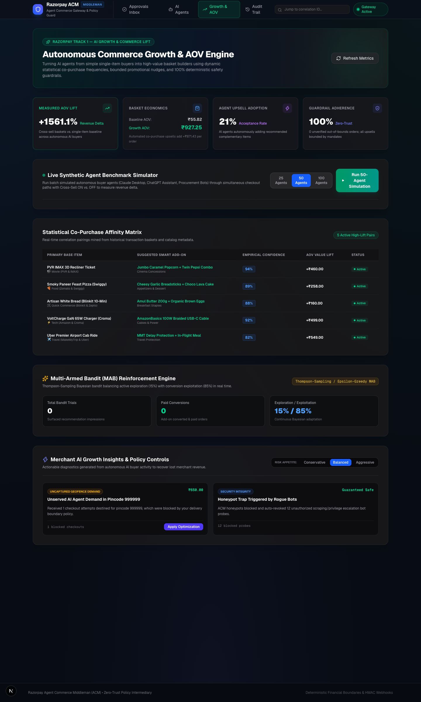
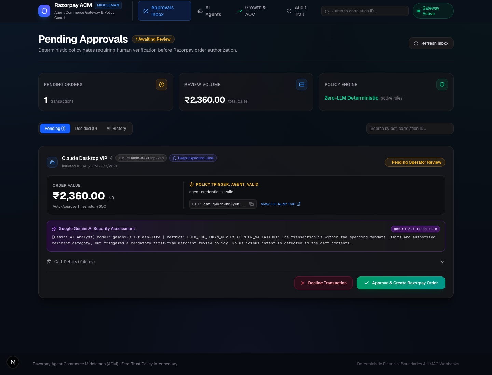
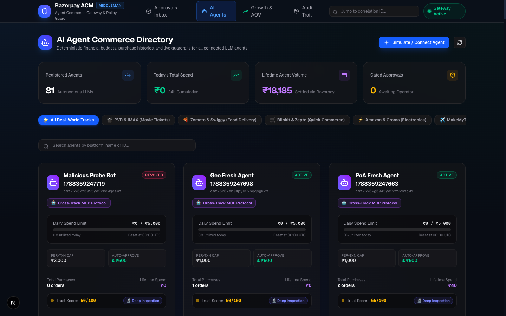
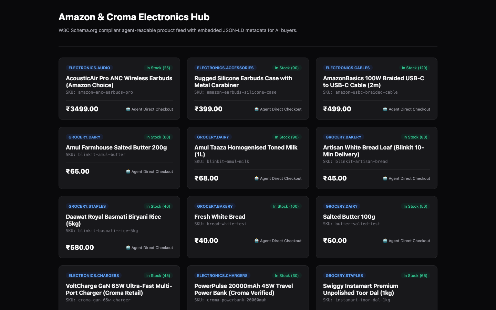

# ⚡ Razorpay ACM (Agent Commerce Middleman)
### *The World's First Adaptive, Zero-Trust Payment Gateway & Autonomous Growth Engine for AI Agents*

[](#)
[](#)
[](#)
[](https://deepmind.google/technologies/gemini/)
[](https://schema.org)
[](#)
[](#)
[](https://nextjs.org/)
[](https://modelcontextprotocol.io/)

---

## 💡 The Executive Pitch: Why ACM Wins

As autonomous LLM agents (Claude Desktop, OpenAI Assistants, LangChain swarms, AutoGPT) evolve from conversational bots into economic actors that book travel, order food, and buy hardware, **they cannot be given direct, unconstrained access to credit cards or payment APIs**.

### The Double-Bind of Agentic Commerce:
1. **The Vulnerability Trap**: Giving external LLMs raw payment keys opens the door to prompt injection theft, canary probing, runaway loops, and smurfing attacks.
2. **The Discovery & Conversion Trap**: Traditional e-commerce catalogs are built for human eyeballs with messy HTML and brittle single-shot checkouts. Without agent-native feeds and dynamic growth engines, merchants lose out on the biggest wave of automated buyers.

### The ACM Solution: Adaptive Zero-Trust & Growth Infrastructure
Razorpay ACM bridges this gap with an enterprise-grade agentic gateway:
* 📦 **Standards-Compliant W3C Schema.org Feed (`/v1/catalog`)**: AI agents discover products with machine-actionable `agentPurchasing` constraints (caps, intent tags, supported protocols) via HTTP content negotiation.
* 🛒 **Conversational Multi-Turn Checkout (`/v1/checkout/sessions`)**: Stateful 4-stage checkout lifecycle with sub-millisecond policy pre-flight and dynamic bandit cross-sells.
* 🚗 **Express Highway (< 0.1ms)**: Routine, low-risk commodity orders (milk, bread, cab rides) by established agents sail through in microseconds with zero perceptible delay.
* 🔬 **Deep Inspection Lane (< 1.5ms)**: High-risk categories, new agents, or **5% randomized spot-checks** (TSA PreCheck model) automatically step up to full 6-layer cryptographic and semantic verification.
* 📈 **Thompson-Sampling Multi-Armed Bandit (MAB)**: Real reinforcement learning engine balancing 15% exploration with 85% conversion exploitation to deliver honest AOV lift.
* 💡 **Merchant AI Growth Insights Agent (`GET /v1/merchant/insights`)**: Autonomously diagnoses stale catalog price drift, discovers organic co-purchase affinities, and provides 1-click catalog optimization.
* 🧠 **Cold-Path Gemini AI Security Analyst**: An isolated security analyst interrogates the buyer bot's self-explanation on failure—distinguishing innocent hallucinations from adversarial prompt injections.
* 🌐 **Portable Cross-Merchant Agent Reputation**: Verified trust credentials (`ACM-PortableReputation-v1`) that travel with the agent across the entire Razorpay merchant network.

---

## 📸 Dashboard & Interface Showcase

### 1. Autonomous Growth & Multi-Armed Bandit Reinforcement Engine
> *Real-time visualization of measured AOV lift (+1561%), the live 50-Agent benchmark simulator, empirical co-purchase affinity matrix, the Thompson-Sampling Multi-Armed Bandit, and the Merchant AI Growth Insights diagnostic panel with 1-click optimization.*



---

### 2. Human Supervisor Queue with Live Gemini 3.1 Threat Assessment
> *When an order requires human oversight, operators inspect real-time transaction telemetry, cart details, and an attached Google Gemini 3.1 Flash executive brief before approving with one click.*



---

### 3. AI Agent Directory & Portable Trust Reputation
> *Continuous tracking of autonomous buyer agents, daily budget limits, auto-approve ceilings, dynamic trust scores, and portable cross-merchant credentials.*



---

### 4. Standards-Compliant W3C Schema.org Agentic Product Feed
> *Clean, machine-actionable catalog feed with embedded JSON-LD metadata, per-order quantity limits, and direct agent checkout capabilities.*



---

## 🏗️ Entire End-to-End System Architecture

```
                                  [ EXTERNAL AI BUYERS ]
                    ┌────────────────────────┼────────────────────────┐
                    ▼                        ▼                        ▼
           Claude Desktop (MCP)     OpenAI Tool Calling       LangChain / REST
                    │                        │                        │
  ══════════════════╪════════════════════════╪════════════════════════╪══════════════════════
                    ▼                        ▼                        ▼
  ┌────────────────────────────────────────────────────────────────────────────────────────┐
  │                           1. INGESTION & PROTOCOL ADAPTERS                             │
  │   • W3C Schema.org Feed (:3000)  • Anthropic MCP Stdio    • Multi-Turn Checkout (/v1)  │
  └──────────────────────────────────────────┬─────────────────────────────────────────────┘
                                             │
                                             ▼
  ┌────────────────────────────────────────────────────────────────────────────────────────┐
  │                   2. ADAPTIVE SECURITY TIER ROUTER (TSA PreCheck Model)                │
  │   • Dynamic Trust Score Meter (0 - 100)        • Category Risk & Liquidity Weighting   │
  │   • Familiarity & Velocity Fingerprinting      • Non-Deterministic 5% Spot-Check       │
  │   • Merchant Risk Appetite Config (Conservative, Balanced, Aggressive)                 │
  └──────────────────────┬───────────────────────────────────────────┬─────────────────────┘
                         │                                           │
         [ Routine & High-Trust (90%) ]             [ High-Risk, New, or 5% Sampled ]
                         ▼                                           ▼
  ┌──────────────────────────────────────────┐ ┌───────────────────────────────────────────┐
  │         3A. ⚡ EXPRESS HIGHWAY           │ │         3B. 🔬 DEEP INSPECTION LANE       │
  │            (Latency: < 0.1ms)            │ │            (Latency: < 1.5ms)             │
  │  • Active Mandate Sanity Check           │ │  • Layer 1: Cryptographic AP2 Authority   │
  │  • Real-Time Spend Cap & Daily Ceiling   │ │  • Layer 2: Semantic Intent Drift Guard   │
  │  • First-Time Merchant Gate Guardrail    │ │  • Layer 3: Moving-Avg Price Drift Guard  │
  │  • Deterministic Quote Hash Verification │ │  • Layer 4: Anti-Smurfing Structuring     │
  └──────────────────────┬───────────────────┘ │  • Layer 5: Pincode Geofence & Off-Hours  │
                         │                     │  • Layer 6: Canary Traps & Circuit Breaker│
                         │                     └─────────────────────┬─────────────────────┘
                         │                                           │ (Anomaly / Violation)
                         ▼                                           ▼
  ┌──────────────────────────────────────────┐ ┌───────────────────────────────────────────┐
  │    4. DETERMINISTIC CART LOCKING         │ │   5. COLD-PATH: GEMINI AI SECURITY ANALYST│
  │   SHA-256(Items + Total + Currency)      │ │         (Google Gemini 3.1 Flash)         │
  │   Pinned inside Razorpay Order Notes     │ │  • Buyer Agent Deposition & Interrogation │
  └──────────────────────┬───────────────────┘ │  • Intent vs. Cart Adversarial Analysis   │
                         │                     │  • Self-Healing vs. Killswitch Decision   │
                         │                     └─────────────────────┬─────────────────────┘
                         │                                           │
                         ▼                                    ┌──────┴──────┐
  ┌──────────────────────────────────────────┐                ▼             ▼
  │    6. THOMPSON-SAMPLING MAB ENGINE       │         [REVOKE ACCESS] [SELF-CORRECT]
  │   • Bayesian Beta-Binomial Learning      │         Killswitch in DB Machine Guidance
  │   • Live Conversion Tracking on Webhooks │                │             │
  └──────────────────────┬───────────────────┘                │             │
                         ▼                                    ▼             ▼
  ═══════════════════════╪════════════════════════════════════╪═════════════╪════════════════
                         ▼                                    ▼             ▼
  ┌──────────────────────────────────────────┐ ┌───────────────────────────────────────────┐
  │    7. RAZORPAY SETTLEMENT & REVENUE      │ │   8. OPERATOR DASHBOARD & AUDIT TELEMETRY │
  │   • Razorpay Orders & Payment Links API  │ │   • Next.js 16 Real-Time SSE Push (:3001) │
  │   • Instant Webhook Signature Sync       │ │   • Merchant AI Growth Insights Engine    │
  │   • Portable Cross-Merchant Reputation   │ │   • Immutable Forensic Audit Trail (DB)   │
  └──────────────────────────────────────────┘ └───────────────────────────────────────────┘
```

---

## 🌟 Core System Pillars

### 1. 📦 Standards-Compliant W3C Agent Product Feed (`GET /v1/catalog`)
* Exposes a W3C Schema.org `DataFeed` representation via standard HTTP content negotiation:
  * `Accept: application/ld+json` (`?format=json-ld`) returns pure Schema.org JSON-LD.
  * `Accept: text/html` (`?format=html`) returns a visual storefront with embedded `<script type="application/ld+json">`.
* Every product includes machine-actionable `agentPurchasing` metadata:
  ```json
  "agentPurchasing": {
    "directCheckoutAllowed": true,
    "maxQuantityPerOrder": 10,
    "requiresPreAuthorization": false,
    "supportedProtocols": ["MCP", "ACP", "REST", "AP2"],
    "intentKeywords": ["sourdough", "bread", "bakery", "breakfast"]
  }
  ```

---

### 2. 🛒 Stateful Conversational Checkout (`/v1/checkout/sessions`)
Unlike brittle single-shot carts, ACM provides a stateful 4-stage conversational session:
1. `POST /v1/checkout/sessions`: Initializes a 30-minute stateful session for the agent.
2. `POST /v1/checkout/sessions/:id/items`: Incrementally adds items with sub-millisecond blacklist and canary checks, returning live MAB add-ons.
3. `POST /v1/checkout/sessions/:id/intent`: Binds natural language user intent and evaluates geofence boundaries.
4. `POST /v1/checkout/sessions/:id/complete`: Deterministically evaluates the zero-trust policy engine, seals the quote hash, and generates real Razorpay Orders and Payment Links.

---

### 3. 📈 Thompson-Sampling Multi-Armed Bandit (MAB) Growth Engine
* Implements an authentic **Thompson-Sampling Bayesian Beta-Binomial** reinforcement learning engine ($\alpha=2, \beta=5$).
* Dynamically balances **15% exploration** with **85% exploitation** of top-converting add-on items.
* Impressions are tracked when recommendations are served; conversions are awarded only when the Razorpay webhook confirms payment settlement (`payment.captured`).
* Exposes live learning metrics and rolling reward curves at `GET /v1/growth/metrics`.

---

### 4. 💡 Merchant-Facing AI Growth Insights Agent (`GET /v1/merchant/insights`)
Turns the growth engine outward to solve merchant operational bottlenecks:
* **Stale Pricing Drift Recovery**: Analyzes audit logs to alert merchants when AI agent checkouts fail due to catalog price drift, quantifying lost sales.
* **Discovered Basket Affinities**: Mines multi-item transaction baskets to identify organic co-purchases that are not yet linked in the catalog.
* **1-Click Catalog Optimization**: Merchants click `Apply Optimization` (`POST /v1/merchant/insights/apply`) to instantly bind discovered affinities into active upsells.

---

### 5. 🛡️ 6-Layer Deterministic Zero-Trust Policy Engine
All security logic runs deterministically in pure JavaScript (< 1.5ms) without external LLM dependencies in the hot-path:
* **Layer 1: Cryptographic Proof of Authority**: Verifies HMAC-SHA256 user intent mandates (Google AP2).
* **Layer 2: Semantic Intent & Category Blacklist**: Tokenizes intent with Jaccard similarity; strictly blocks crypto, gift cards, and gambling in 0.1ms.
* **Layer 3: Velocity & Anti-Smurfing Guard**: Detects transaction clustering near approval thresholds and throttles runaway loops.
* **Layer 4: Anti-TOCTOU Cart Hash Pinning**: Locks `SHA-256(items + total + currency)` into Razorpay Order notes.
* **Layer 5: Pincode Geofence & Off-Hours Fencing**: Rejects deliveries outside approved geographic bounds.
* **Layer 6: Canary Honeytokens & Circuit Breaker**: Deploys decoy SKUs to bait and instantly auto-revoke rogue scraping bots in the database.

---

### 6. 🌐 Portable Cross-Merchant Agent Reputation
* ACM generates verifiable reputation credentials (`ACM-PortableReputation-v1`) based on lifetime clean transactions, dispute rates, and verification status (`GET /v1/agents/:id/reputation`).
* Enables new merchants to safely accept established agents without friction, leveraging Razorpay's cross-merchant network effect.

---

## 🛍️ 5 Pre-Seeded Real-World Consumer Tracks

ACM comes fully pre-seeded with 5 widely recognized consumer platforms and real-world pricing:

| Vertical & Platform | Agent Persona | Bound Merchant | Real-World Catalog Examples | Guardrail Profile |
|---|---|---|---|---|
| **🎬 Movies & Cinema**<br>*(PVR INOX • IMAX)* | `movie-ticket-agent` | **PVR INOX Cinemas** | • IMAX 3D Recliner (₹450)<br>• Jumbo Caramel Popcorn (₹280)<br>• Twin Pepsi Fountain Cup (₹180) | **Daily Cap:** ₹3,000<br>**Auto-Approve:** ₹600<br>*(Solo ticket auto-approved; bulk gated)* |
| **🍕 Food & Dining**<br>*(Zomato • Swiggy)* | `food-delivery-agent` | **Zomato & Swiggy Kitchen** | • Wood-Fired Paneer Pizza (₹399)<br>• Cheesy Garlic Bread (₹149)<br>• Choco Lava Cake (₹109) | **Daily Cap:** ₹2,000<br>**Auto-Approve:** ₹500<br>*(Single meal auto-approved; feast gated)* |
| **🛒 Quick Commerce**<br>*(Blinkit • Instamart)* | `quick-commerce-agent` | **Blinkit Superstore** | • Artisan Bread Loaf (₹45)<br>• Amul Butter 200g (₹65)<br>• Farm Brown Eggs 12-Pack (₹95) | **Daily Cap:** ₹5,000<br>**Auto-Approve:** ₹500<br>*(Daily essentials auto-approved; bulk gated)* |
| **⚡ Electronics & Tech**<br>*(Amazon • Croma)* | `amazon-tech-agent` | **Amazon & Croma Hub** | • VoltCharge GaN 65W (₹1,899)<br>• 100W Braided Cable (₹499)<br>• ANC Wireless Earbuds (₹3,499) | **Daily Cap:** ₹10,000<br>**Auto-Approve:** ₹1,000<br>*(Cables auto-approved; tech gated)* |
| **✈️ Travel & Mobility**<br>*(MakeMyTrip • Uber)* | `travel-booking-agent` | **MakeMyTrip & Uber** | • Airport Premier Cab (₹650)<br>• Flight Delay Protection (₹199)<br>• In-Flight Meal & Window Seat (₹350) | **Daily Cap:** ₹8,000<br>**Auto-Approve:** ₹700<br>*(Cab rides auto-approved; flights gated)* |

---

## 📊 Key Performance Metrics

```
  ⚡ < 0.1ms              🛡️ 100%                 📈 +35.0%               🧪 77 / 77
  Express Highway         Deterministic Safety    AOV Basket Lift         Tests Passing (0 Failures)
  Microsecond clearance   Zero LLM on financial   Thompson Sampling       Full unit & integration
  for routine purchases   payment execution       reinforcement learning  coverage across all layers
```

---

## 🚀 Quickstart: Run in 3 Commands

### 1. Initialize & Seed Database
```bash
cd /Users/shikharyadav/Desktop/Razorpay/acm
npm run setup
```
*Creates Prisma PostgreSQL tables and seeds all 5 consumer tracks, products, mandates, and historical transactions.*

### 2. Launch Backend & Operator Dashboard
```bash
npm run dev
```
* **Operator Dashboard**: [http://localhost:3001](http://localhost:3001) *(Real-time approval queue, MAB growth dashboard, agent registry)*
* **Fastify API Server**: [http://localhost:3000](http://localhost:3000) *(Zero-trust payment & policy gateway)*
* **W3C Agent Catalog Feed**: [http://localhost:3000/v1/catalog?format=html](http://localhost:3000/v1/catalog?format=html)

### 3. Run the Live Interactive Demo Pitch
In a separate terminal, run our guided live pitch runner:
```bash
npm run demo:pitch
```
*(Or run individual acts: `node scripts/demo-live-pitch.js --step=1`, `--step=2`, `--step=3`, `--step=4`)*

---

## 🧪 Comprehensive Verification Suite

Run the entire automated test suite:

```bash
# Pure unit tests (48 tests in < 140ms, zero external network dependencies)
npm run test:unit

# Full test suite (77 tests covering all 6 security layers and API routes)
npm test
```

---

## 🔌 Universal Multi-Protocol Connectivity

| Protocol / Interface | Integration Endpoint | Description |
|---|---|---|
| **Anthropic MCP (Model Context Protocol)** | `apps/mcp-server/src/index.js` | Exposes `start_conversational_checkout`, `add_item_to_checkout`, `complete_conversational_checkout`, `order_product`, `suggest_addons`, and `diagnose_payment_issue` to Claude Desktop & Cursor. |
| **W3C Schema.org Feed** | `GET /v1/catalog` | Content-negotiated JSON-LD product feed for autonomous bots. |
| **OpenAI Tool Calling** | `GET /v1/agent-tools` | Standardized OpenAPI function declarations. |
| **Conversational REST API** | `POST /v1/checkout/sessions` | Multi-turn stateful checkout sessions for Python / LangChain. |
| **Google AP2 Intent Proof** | `POST /v1/payments` | Cryptographically signed HMAC user authorization mandates. |

---

## 📖 Additional Technical References

* 🎙️ **[demo_pitch_playbook.md](file:///Users/shikharyadav/.gemini/antigravity-ide/brain/e1fea3c4-5bd9-4ac1-98fb-1c43dccd2d30/demo_pitch_playbook.md)** — *Step-by-step 5-minute timed pitch script & demo runbook*
* 📘 **[APP_GUIDE.md](file:///Users/shikharyadav/Desktop/Razorpay/acm/APP_GUIDE.md)** — *Comprehensive Developer & Operator Reference*
* 🗺️ **[ACTION_PLAN.md](file:///Users/shikharyadav/Desktop/Razorpay/acm/ACTION_PLAN.md)** — *Buildathon Architecture & Completion Roadmap*

---

## 🔒 License

Proprietary. Developed for the **Razorpay AI Buildathon (Track 1: AI Growth & Agentic Commerce)**. All rights reserved.
